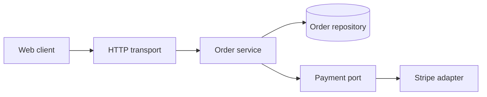
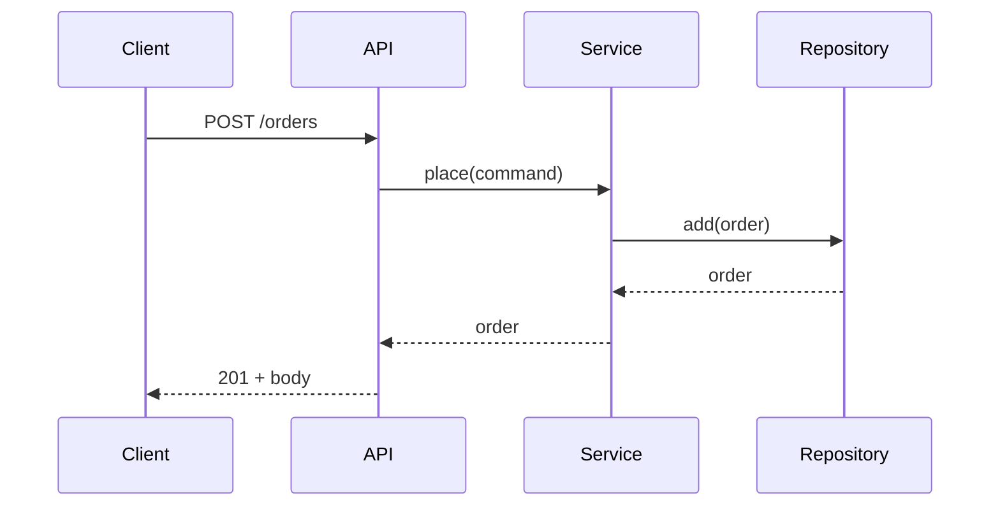

# System design - <feature or change>

Written to `docs/design/<slug>/system-design.md` before implementation starts, at
`standard` tier and above. Delete any section that genuinely does not apply and say why -
an empty heading is worse than an absent one.

Date: <YYYY-MM-DD>
Status: draft | approved at the plan gate | superseded

---

## 1. Problem and scope

What this change must make true, in two or three sentences, in the product's own terms.
Then the boundary:

**In scope:** <the things this change delivers>
**Out of scope:** <the things a reader might reasonably assume are included, and are not>

The out-of-scope list is the load-bearing half. It is what stops the plan growing during
implementation.

## 2. Bound architecture

| Decision | Bound | Why |
|---|---|---|
| Application pattern | <layered-ports / hexagonal / modular-monolith / ...> | <one line> |
| Frontend pattern | <container-presentational / feature-sliced> | <one line> |
| Stack | <detected, not chosen> | detected from <marker files> |

If a `scale_up_from` pattern was adopted, name the **trigger that fired**. If the repo
already had a pattern, say so - that it already existed is the reason, and it outranks
the default.

## 3. Components

A diagram, and one line per component saying what it owns.

| Component | Owns | Role |
|---|---|---|
| <name> | <its single responsibility> | transport / service / adapter / dumb / smart |

Arrows point the way dependencies point. If an arrow runs outward from the domain, that
is the design defect to fix here, while it is still a diagram.

## 4. Data model

Entities, their fields with types, and - the part usually skipped - their **constraints
and invariants**:

- What must be unique.
- What may never be null, and what that means if it happens.
- What cardinality each relationship really has, including the awkward one.
- Which invariant the database enforces versus which the application enforces, and why.

Migration notes: what changes, whether it is reversible, and whether it is safe to deploy
before the code that uses it.

## 5. Primary flow

The main path, step by step, naming the component that handles each step.

Then the variants that are not the main path: the unauthorised case, the concurrent case,
and the case where a downstream dependency is slow rather than down.

## 6. Failure modes

| What fails | What the user sees | What the system does | Recovered how |
|---|---|---|---|
| <dependency times out> | <a specific message> | <retry / fail fast / degrade> | <automatic / manual> |

Every row is a case the tests must cover. A failure mode with no row here becomes an
unhandled exception in production, so incompleteness is the risk to attack.

## 7. Non-functional posture

- **Scale** - expected volume, and the first component that becomes the bottleneck.
- **Latency** - the budget, and where it is spent.
- **Security** - authentication and authorisation model, what data is sensitive, where
  the trust boundary sits, and what is validated on which side of it.
- **Observability** - what is logged, what is measured, and what the first alert would be.
- **Accessibility** - if UI: the conformance target and anything structurally hard.

## 8. Trade-offs

| Chosen | Rejected | Why |
|---|---|---|

A design with no rejected alternative was not designed - it was defaulted. Say so
honestly if that is what happened; a defaulted decision is fine when the default is
right, and knowing it was a default is what makes it cheap to revisit.

Decisions expensive to reverse get their own ADR under `adr/`, using
`${CLAUDE_PLUGIN_ROOT}/templates/adr.md`. Cheap ones stay in this table.

## 9. Open questions

Anything unresolved, with who or what would resolve it and by when it must be. An open
question carried silently into implementation becomes an assumption nobody agreed to.

---

| Version | Date | Change |
|---|---|---|
| 1 | <YYYY-MM-DD> | initial |
